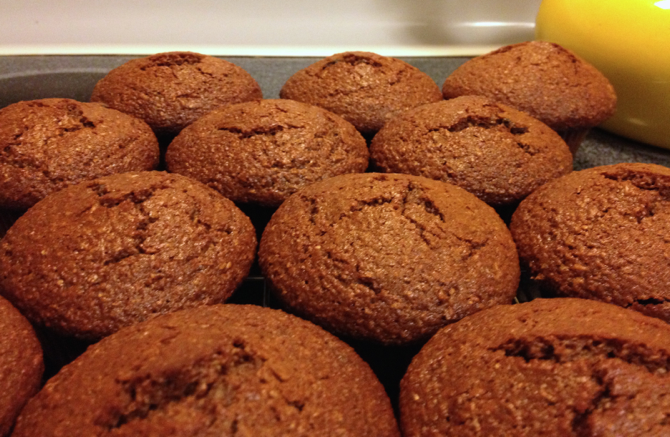

# Bran Muffins for Mom

This is a slight alteration of "Raisin Bran Muffins That Work," Recipezaar recipe #73061, that my mother likes. I made it non-dairy. I've only made the blueberry version once or twice.

## Ingredients

* 2 eggs
* 1 c. soy milk
* 1/2 c. canola oil
* 1/4 c. molasses
* 3/4 c. brown sugar
* 1/2 tsp. vanilla extract
* 1 1/2 c. wheat bran
* 1 1/2 c. flour
* 3/4 tsp. salt
* 2 tsp. baking powder
* 1/2 tsp. baking soda
* 1 c. raisins (or blueberries, diced pear, etc.)

## Directions

1. Beat wet ingredients and sugar.
2. Preheat oven to 400° F.
3. Add bran to liquid and let sit 5 minutes.
4. Dust raisins with rye or white flour.  Separate if stuck.
5. Mix other dry ingredients in separate bowl.
6. Add flour mixture to bran mixture and stir gently.
7. Add raisins.
8. Fill 12--15 muffin cups.
9. Bake 20 minutes.

## Variants

You can use milk.

Replace 1/2 c. of the white flour with 1/2 c. almond flour plus 1 tsp. vital wheat gluten plus 1/2 tsp. baking powder.

I made a diced pear version once.
