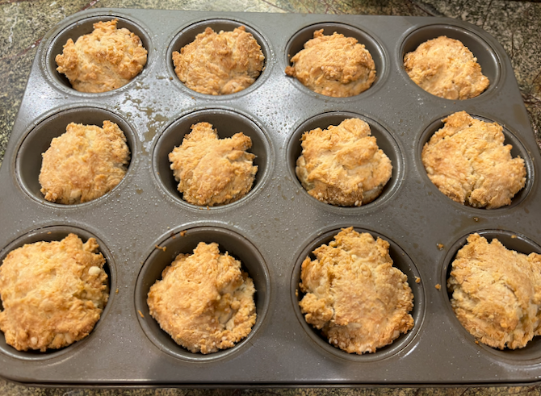

[photographed]: ../indices/photographed.html

# Easy Sour Cream Biscuits

The hard part of easy biscuit recipes is figuring out what self-rising flour is.  In my role of googling it for you, I've adapted [a sour cream "muffin" recipe](https://www.theseasonedmom.com/sour-cream-muffins/ ) to use a list of real ingredients.

Makes 9--12 small biscuits.

## Ingredients

* 2 c. flour
* 2 tsp. baking powder
* 1/2 tsp. baking soda
* 1 tsp. salt
* 1 c. sour cream
* 1 stick salted butter, melted

## Directions

1. Preheat oven to 350° with convection.
2. Prepare muffin tin with spray or muffin cups.
3. Melt butter and bring sour cream to room temperature.
3. Mix dry ingredients well.
4. Mix in melted butter and sour cream without overmixing.
5. Press gently into muffin pan.  
6. Bake for 25 minutes or until golden on top. 
7. Optionally, brush tops with more melted butter.
8. Cool in pan briefly then serve or transfer to a rack.

## Variants

The original recipe suggested substituting full fat plain yogurt for the sour cream, but made no promises.  I tried a mix of sour cream and yogurt.

For non-dairy biscuits see my [coconut oil](../quick-bread/coconutOilBiscuits.md) or [Guinness](../quick-bread/guinnessBiscuits.md) biscuits.

I haven't tried it, but [this three-ingredient recipe](https://www.southernliving.com/food/bread/three-ingredient-sour-cream-biscuits) is the simplest.  Per cup of non-self-rising flour, you would also need 1 tsp. baking powder, 1/4 tsp. baking soda, and 1/2 tsp. salt.
