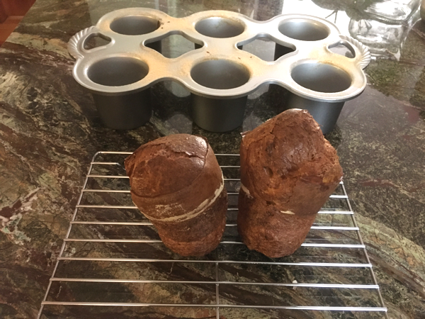

[photographed]: ../indices/photographed.html

# Popovers

This is more or less [the recipe](https://www.nordicware.com/recipe/rosemary-popovers/) that came with my six-popover [popover pan](https://www.nordicware.com/grand-popover-pan).
I added the frozen herb cubes, though my experiments with several frozen spices have not yet made much of an impression on the outcome.

Note that you can make the batter ahead of time.

Makes 6 large popovers.

## Ingredients

* 2 eggs
* 1 c. whole milk
* 1 c. flour
* 1 T. melted butter
* 1/2 tsp. salt
* 2 tsp. fresh or frozen herbs (optional)
* 1 tsp. sugar (optional)

## Directions

1. Preheat the oven to 425°.  Lower the rack.
2. Butter the pan.  Optionally, dust with flour.
3. Melt the butter (and optional frozen herbs) in the oven.
4. Mix ingredients until smooth but don't overmix.  (Optionally, refrigerate overnight.)
5. Fill popover cups halfway.
6. Bake 20 minutes.
7. Reduce oven to 350° and bake up to 20 more minutes until golden.
8. Serve hot.

## Variants

I haven't tried making the batter ahead of time, but the recipe certainly seems resilient enough to handle that.

There is a wealth of popover advice [at SFGate](https://www.sfgate.com/recipes/article/Baker-s-quest-What-makes-perfect-popovers-4601293.php),
plus some interesting variants involving cheese.
I wouldn't take the advice too much to heart, since it's completely wrong about lactose-free milk not working.
Neither heating nor chilling the batter (both are advised!) seemed necessary, either,
though you might want to consider her advice if you're working with a substandard pan.
