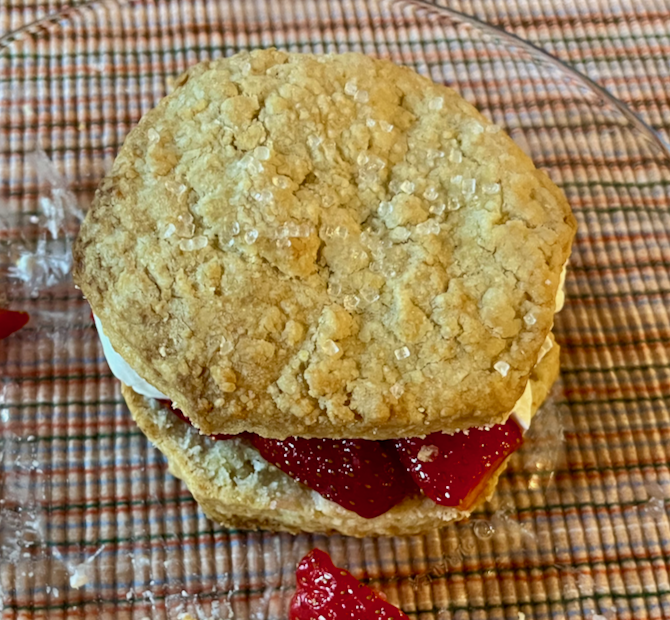

[photographed]: ../indices/photographed.html

# Strawberry Shortcake

This is another Mother's Day request, based on plenty of similar recipes.  Some recipes use two different creams for the dough and topping, but [The New York Times](https://cooking.nytimes.com/recipes/11823-strawberry-shortcake) was thoughtful enough to just use whipping cream for the heavy cream, while [The Kitchn](https://www.thekitchn.com/summer-recipe-oldfashioned-str-150927) did it all with heavy cream.  (This recipe is cut down from those, so see them for better scaling up.)

For non-dairy biscuits, see my [coconut oil](../quick-bread/coconutOilBiscuits.md) or [Guinness](../quick-bread/guinnessBiscuits.md) biscuit recipes.

Serves 4.   
Makes 8--10 biscuits.

## Ingredients

### Shortcake

* 2 c. white flour
* 1 T. baking powder
* 1/2 tsp. salt
* 1 1/2 T. sugar
* 3/4 stick butter (6 T.)
* 1/2 T. vanilla extract
* 3/4 c. cream
* 1 T. sanding sugar (optional topping)

### Strawberries

* 1 pint strawberries, cut to a desirable size
* 1/4 c. sugar 

### Whipped Cream

* 1 c. cream
* 1 1/2 T. confectioners sugar (optional)
* 1/4 tsp. cream of tartar (optional)
* 1/4 tsp. vanilla extract (optional)

## Directions

### Shortcake

1. Mix the dry, non-topping shortcake ingredients.
1. Preheat the oven to 425° (400° with convection).
2. Cut in the butter with a pastry cutter (not all the way to pea size).
3. Stir or cut in the cream and vanilla.
4. Press the dough together like pie dough.
5. Roll out the dough to **1 inch** thickness.
6. Cut out with a ~3 inch cookie cutter or a biscuit cutter.
7. Put on greased or lined cookie sheet and brush with butter or cream.
8. Optionally sprinkle with sanding sugar.
9. Bake 15 minutes until golden.
10. Cool on a rack before splitting.

### Strawberries

1. While baking shortcake (or first), prep strawberries by mixing with sugar as specified or to taste/ripeness.
2. Stir occasionally.

### Whipped Cream

1. Whip cream.  
2. Add sugar and tartar mix slowly, while beating to desired perkiness.  
3. Optionally then beat in extract.

If you are using an immersion blender whisk or other handheld electric device, **do not let go of anything** while whipping.

## Variants

You can make dough with a food processor if you insist.  You can also skip the pastry cutter and just use a fork or your fingers to incorporate the butter.

You can make individual biscuits by rolling out to half an inch intsead of an inch.  
If you don't have a cookie cutter of the appropriate size, you can use a smaller one and then roll the biscuits out flatter after cutting.

Some recipes scoop the dough by 1/3 cups rather than rolling it out, for a craggier effect.  See, for example, [The Pioneer Woman](https://www.thepioneerwoman.com/food-cooking/recipes/a39026449/strawberry-shortcake-recipe/) and [The Spruce Eats](https://www.thespruceeats.com/our-best-strawberry-shortcake-recipe-7482908).  

I spotted one recipe that used milk instead of cream for the shortcake.

Some people roast strawberries.  

You can substitute almost any fruit.
