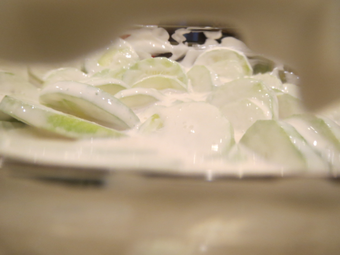
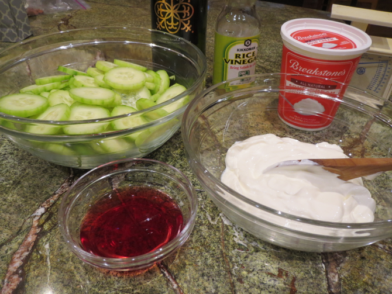
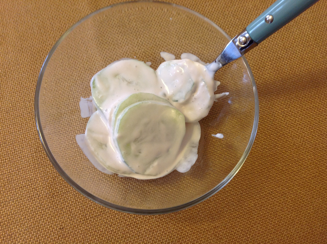

[photographed]: ../indices/photographed.html
[potluck]: ../indices/potluck.html

# Mizeria (Polish Cucumber Salad)

This is a recipe of Peter's that we've brought to a few potlucks. Quantities are approximate.

## Ingredients

* 3 cucumbers
* 2/3--3/4 lb. sour cream or plain yogurt (full fat)
* 4 T. (1/4 c.) wine vinegar
* fresh dill (optional)

## Directions

1. Unless the cucumbers are completely unwaxed, peel stripes off the cucumbers (or fully peel them).
2. Slice cucumber thin.
3. Mix all ingredients.

## Variants

If using yogurt that isn't sour (e.g., Cabot Greek yogurt), adjust the vinegar to taste.

In case of emergency, substitute 1 T. wine and 3 T. vinegar for the wine vinegar, or just use cider vinegar.

Traditionally, the cucumbers are salted and drained before use (we've never done that), and black pepper may be included along with the dill.

