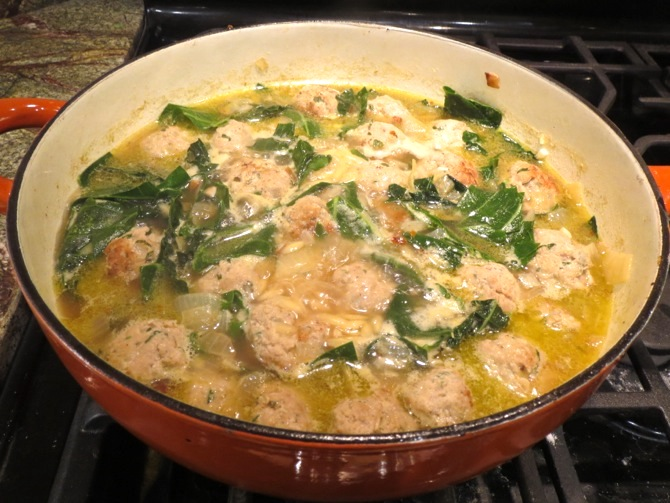

[photographed]: ../indices/photographed.html

# Italian Wedding Soup

I was in the mood for soup with turkey meatballs.  This recipe is based on [Italian Wedding Soup with Turkey Meatballs and Orzo](http://www.willcookforsmiles.com/2014/09/italian-wedding-soup-turkey-meatballs-orzo.html) by Lyuba, which I liked for its speed and lack of foreign roots like carrots and celery.  I altered the recipe significantly to make it non-dairy, spice up the meatballs a bit, and cut the stock down to a quantity that fits both my budget and my heavy soup pot.  As a consequence, I only got about four servings out of it.

## Ingredients

### Meatballs

* 1 lb ground turkey
* 1/4 c. onion, minced
* 2 cloves garlic, minced
* 1 T parsley, minced
* 1/2 c. panko
* 1 tsp salt
* 1/4 tsp pepper
* 1 tsp sage
* dash thyme
* 2 tsp nutritional yeast (optional)
* 1 egg, beaten
* olive oil

### Soup

* 2 T. olive oil
* 1/2 c. onion, chopped
* 1 clove garlic, chopped
* 4 c. chicken stock
* 1 c. water
* 6--8 c./1 bunch chopped greens: escarole, collards, kale, chard, or a mix thereof 
* 2/3--3/4 c. orzo
* 1/4 tsp salt (or however much the stock still needs)
* 1/4 tsp red pepper flakes
* 1 egg, beaten

## Directions

1. Mix meatball ingredients except oil.
2. Roll meatballs as small as you can tolerate, possibly with the help of a tablespoon.
2. Brown meatballs in oil in a heavy pot.
3. Remove meatballs if you need the space, and brown onions and garlic in the same pot.
4. Return meatballs to pan if they left.  Add stock and water.  Bring to a boil.
5. Add spices, orzo, and greens.  Cook for the recommended orzo cooking time (about 10 minutes).
6. Stir in the egg slowly to get that egg-drop look.  Cook 2 more minutes.

## Variants

You could make the meatballs out of another ground meat, though in that case you might (or might not) want to adjust the meatball spices.  E.g., for 1 lb. ground beef, replace the 1 tsp sage with 1 tsp basil and dash some marjoram, oregano, and/or the thyme.  (Italian seasoning is not an Italian thing, but you can use 1 tsp of that instead if you have it.)  See [More Meatballs](../meat/moreMeatballs.md) for more details.

Any small pasta can be used in place of the orzo; adjust the cooking time for that step accordingly and use about a quarter of a pound.

Sometimes I cook the pasta outside of the soup to keep it from sucking up too much broth.

One variant is official:  [Spinach Wedding Soup](../soup/spinachWedding.md)
