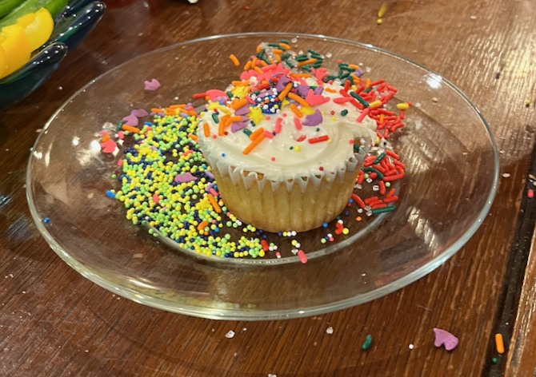

# Vanilla Cupcakes

I made the whole recipe from [The Spruce Eats](https://www.thespruceeats.com/perfect-vanilla-cupcakes-4120605) and split it into a dozen regular and two dozen mini cupcakes.  Here I've cut it down to one or the other.  I usually have plain yogurt around.

Makes 12 regular or 24 mini cupcakes.

## Ingredients

### Dry

* 1 c. white flour
* 1/2 tsp baking powder
* 1/4 tsp baking soda
* 1/4 tsp salt

### Wet

* 1 c. sugar
* 1 stick butter, softened
* 2 eggs
* 1/2 T. vanilla extract
* 1/2 c. whole milk yogurt

## Directions

1. Preheat oven to 350° (with convection).
2. Prepare a muffin tin or mini muffin pan, preferably with muffin cups.
3. Mix dry ingredients in a small bowl and set aside.
4. Cream butter and sugar in a large bowl or a stand mixer.
5. Mix in eggs and vanilla.
6. Alternately mix in yogurt and dry ingredient mixture.
7. Optionally, cream using an immersion blender.
8. Bake 20 minutes (12 for mini size), or to the toothpick test.

## Variants

I'd probably like them better with a bit less sugar, but cupcake experts thought they were correct.

