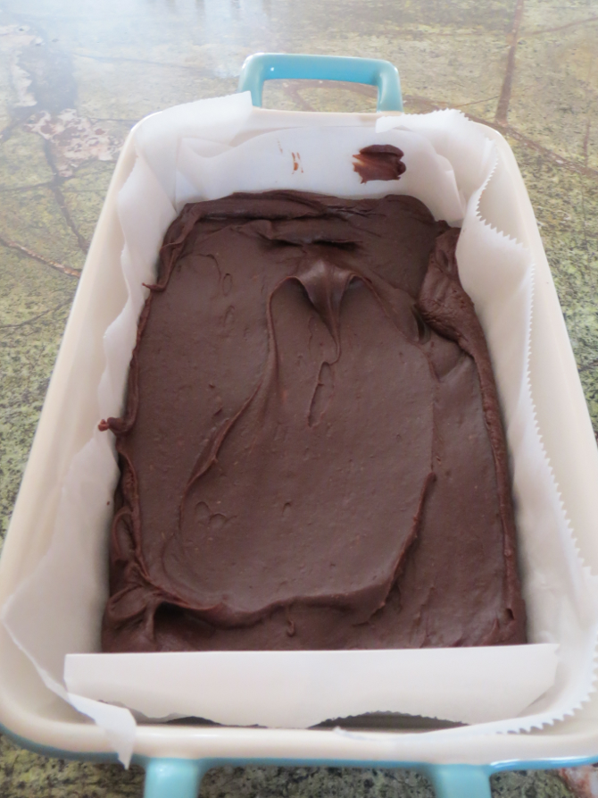
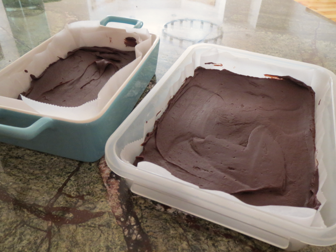
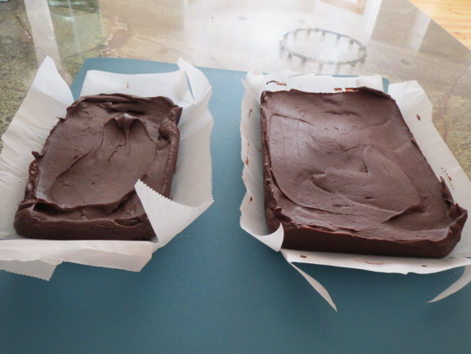
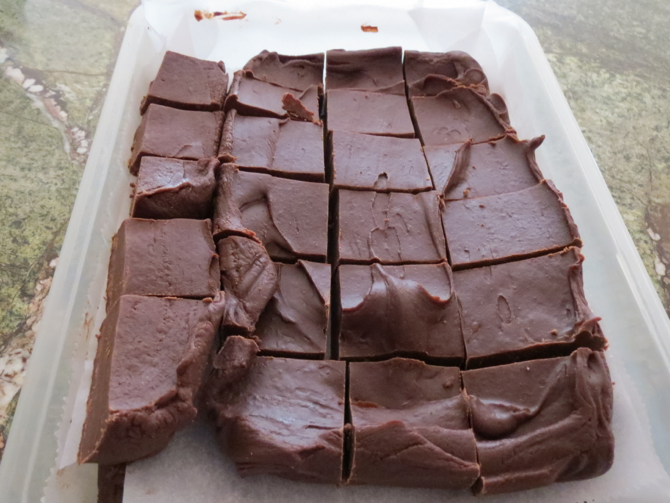

[photographed]: ../indices/photographed.html

# Tasty Easy Fudge

This is an even easier easy fudge, with just the basic ingredients from [Eagle Brand](https://www.eaglebrand.com/recipe/chocolate-fudge/), along with my addition of some almond or peppermint extract.  For more easy-fudge-making detail (not that there are many more details), see my [Nutella fudge recipe](../sweets/nutellaFudge.md).

## Ingredients

* 3 c. (18 oz.) semi-sweet chocolate chips
* 1 can (14 oz.) sweetened condensed milk
* dash salt
* 1/2 tsp vanilla extract
* 1 tsp almond extract

## Directions

Line an 8x8 pan or 64 square inches of convenient rectangular receptacles with parchment paper.  Leave some overlap for later fudge extraction. 

Mix all ingredients but extracts in a double boiler until melted and smooth.  Add extract.

Pour into pan(s) and smooth with a spatula.  Chill two hours.

Lift out of pan(s) and cut to desired size.

## Variants

Replace almond extract with peppermint extract for mint fudge.

