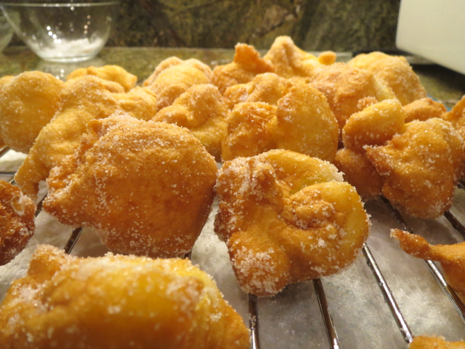

[photographed]: ../indices/photographed.html

# Sonhos (Portuguese Doughnuts)

I made sonhos one Sunday because I didn't have the time to attempt malassadas or [cuddureddi](http://leitesculinaria.com/91541/recipes-cuddureddi-raised-doughnuts.html), and I couldn't find a beignet recipe that was actually a proper choux pastry instead of a standard yeast doughnut.  I followed [the sonhos recipe at Leite's Culinaria](http://leitesculinaria.com/7788/recipes-portuguese-doughnuts.html), which they don't want reproduced elsewhere, so this cookbook entry is just my comments on the process.  And a picture:

The recipe uses the vague term "beat" for the process of incorporating the eggs into the cooked water/flour ball.  I don't have a stand mixer or eggbeater, and my manual mixer was occupied with vacuuming the house, so I ended up using my immersion blender.  It seemed to be effective.  I used a trigger scoop to get the dough into the oil.

Peter doesn't like confectioner's sugar and most of the pictures I found online (the Leite's recipe didn't have pictures) showed regular granulated sugar instead, a la malassadas, so I used that.  In the process I forgot to add the cinnamon, so they turned out a bit pedestrian.  I have a nice candy thermometer that hangs in the pot, but still had some trouble keeping the oil at a steady 360°.  Many of the doughnuts cracked and poofed open during frying---maybe because the outside cooked too fast---and a few collapsed after removal.

Peter called them fluffy, apparently because his grandmother used to make the densest doughnuts ever, but I found them a bit eggy.  Still, I'd do it again because it was relatively quick and easy, for doughnuts.  Also, it seems they could be made non-dairy easily with the substitution of oil for the one tablespoon of butter.

