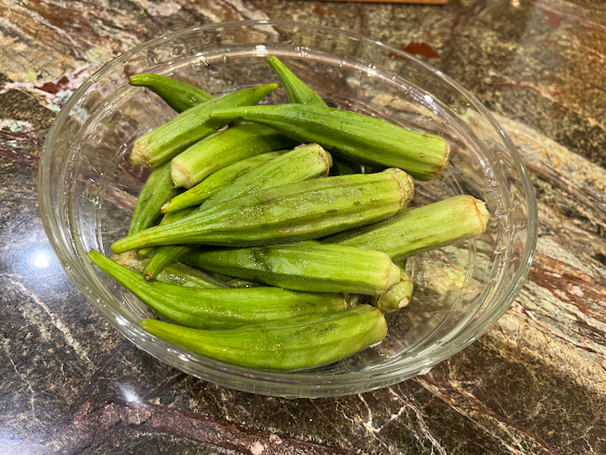
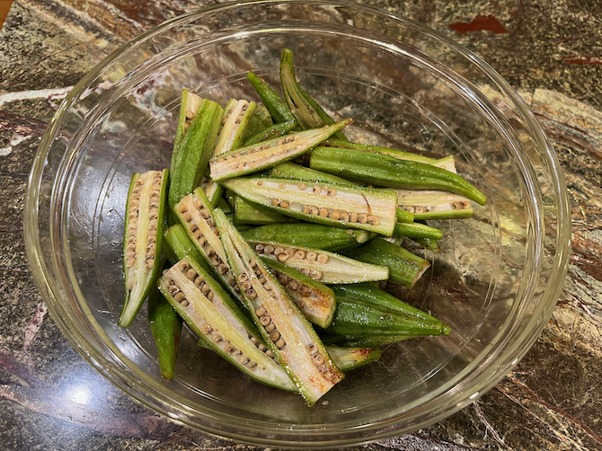
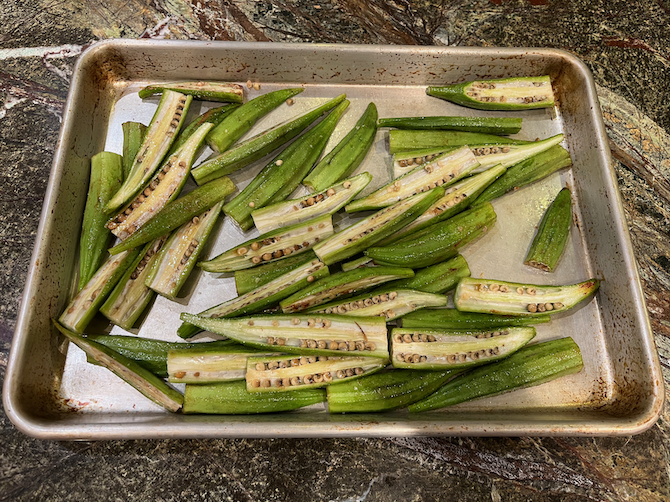

# Roasted Okra

I bought some okra at H-Mart even though Peter hates the slime, then I found [a list of slime-free okra recipes](http://localfoods.about.com/od/okra/tp/5-Easy-Okra-Recipes.htm).  I went with the [roasting recipe](http://localfoods.about.com/od/okra/r/Roasted-Okra.htm) because Peter enjoys roasted veggies even when I think I've roasted them a bit too long.

I cut the recipe down and changed the oil because the okra was going with Japanese food.

Serves 2--3.

## Ingredients

* 3/4 lb. fresh okra
* 1/2 T. sesame oil (or extra-virgin olive oil)
* 1 1/2 scallions total, preferably the whiter bits of 3 or 4 scallions
* 1/4 tsp. sea salt or to taste

## Directions

1. Preheat the oven to 400°.  If your okra needs washing, dry it well afterwards.  
2. Trim the tops off, then slice each okra in half lengthwise.
3. Chop the scallion to match in length.
3. Toss all ingredients in a large bowl.  
4. Spread in 1 layer in a shallow baking pan, optionally lined with parchment paper for your convenience.  
5. Roast about 25 minutes (or less, depending on size), stirring halfway through.

## Variants

I often omit the scallions and ad-lib other spices as in the images above.
